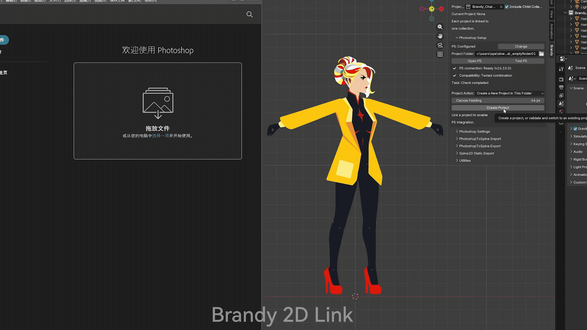
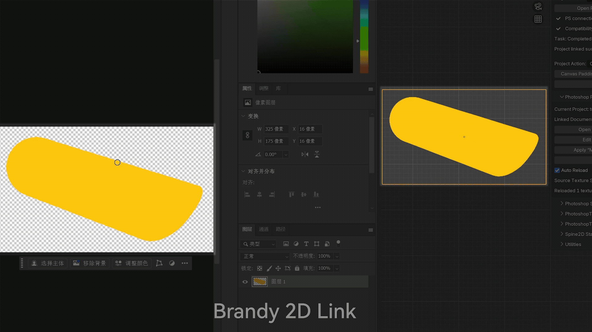

# Brandy 2D Link

[简体中文](README_zh-CN.md) · [Quick Start](docs/QUICK_START.md) · [User Guide](docs/USER_GUIDE.md) · [Compatibility Checklist](docs/COMPATIBILITY_AND_PURCHASE_CHECKLIST.md) · [Support](docs/SUPPORT.md) · [Release Notes](docs/RELEASE_NOTES.md)

**A lightweight Photoshop-to-Blender texture iteration workflow for 2D game art.**

Brandy 2D Link is a Windows x64 Blender add-on for artists, animators, technical artists, and 2D game developers who use Blender together with the Adobe Photoshop desktop application.

The core loop is intentionally simple: prepare sprite objects in Blender, create a Brandy project, edit project texture files in Photoshop, save the images, and reload the matching material textures in Blender manually or with Auto Reload.

It is a save-triggered workflow, not brush-by-brush live streaming.

- English tutorial: https://youtu.be/seKdFcPqHf4
- Chinese tutorial: https://youtu.be/-xTnPTlHHwc

Start Blender and Adobe Photoshop Workflow:

Paint-Save-Reload:

Get Brandy 2D Link on itch.io: https://brandyspe.itch.io/brandy-2d-link

## What It Helps With

Layered 2D assets in Blender often use many separate texture files. Editing them manually can become repetitive: find the right texture, open it, save it, return to Blender, refresh it, and keep the complete assembled asset in mind.

Brandy 2D Link turns that into a predictable project workflow:

1. Prepare or import a static sprite layout in Blender.
2. Create or link a Brandy project from one Blender collection.
3. Open a project texture or the linked PSD/PSB in Photoshop.
4. Paint and save.
5. Use **Reload Textures** or **Auto Reload** in Blender.
6. When context painting is needed, apply visible, name-matched layers from `Brandy | Merge Layers` back to the matching project textures.

Saving only the linked PSD/PSB does not update Blender. Blender reloads the individual texture files stored in the project `textures` folder.

## Main Features

- Create, link, switch, validate, and recover independent Brandy project folders.
- Open the active sprite texture directly in Photoshop.
- Reload project textures manually or with save-triggered Auto Reload.
- Generate a linked PSD/PSB document with Smart Objects for full-layout painting context.
- Apply visible, top-level, name-matched layers from `Brandy | Merge Layers` to matching source textures.
- Create trusted backups before supported destructive write operations.
- Undo the latest successful merge when strict file-integrity checks still pass.
- Protect source texture dimensions, linked-document structure, project locks, task records, and recovery state.
- Work with PNG, TGA, JPG, and JPEG static texture workflows.
- Import and export supported PhotoshopToSpine static JSON layouts.
- Import a limited set of static Spine2D Region Attachments.
- Use utility tools for texture-format switching, imported material restoration, shader-value copying, duplicate generated material merging, and viewport isolation.
- Use the interface in **Auto / 中文 / English**.

## Intended Users

Brandy 2D Link is designed for:

- 2D game artists working between Photoshop and Blender.
- Sprite, billboard, cutout, and layered character texture iteration.
- Artists who want to paint while checking a complete assembled asset.
- Technical artists preparing Photoshop–Blender assets for a larger game pipeline.
- Small teams that prefer a focused, file-based workflow instead of a broad all-in-one pipeline tool.

## What It Is Not

Brandy 2D Link is not:

- a real-time brush streaming system;
- a Photoshop-side panel or UXP extension;
- a direct Unity, Unreal Engine, or other engine exporter;
- a full Spine rig, Mesh Attachment, constraint, two-color Tint, or animation importer;
- a tool for arbitrary non-rectangular meshes or unrestricted UV layouts;
- support for Photoshop web, Photoshop for iPad, non-Adobe image editors, macOS, or Linux;
- a replacement for independent backups, version control, or normal Blender and Photoshop knowledge.

## Asset Requirements

Each project sprite should use:

- a file-based PNG, TGA, JPG, or JPEG texture;
- a flat rectangular mesh;
- a valid rectangular active UV area;
- a unique base name;
- a consistent 2D plane orientation.

Internal mesh subdivisions are allowed when the outer boundary remains rectangular. Depth offsets may be used for visual stacking.

Source texture pixel dimensions must remain unchanged after a project is linked. Resize texture canvases before creating the Brandy project. PNG or TGA is recommended for repeated lossless painting.

Brandy 2D Link is built around standard file-based Image Texture usage. Image Texture nodes hidden inside custom Shader Node Groups are not the documented texture source.

## Compatibility Summary

The official Brandy 2D Link 1.6.3 package is supported for Windows x64 and the tested host versions below.

**Blender**

- Blender 4.2.21 LTS
- Blender 4.3.2
- Blender 4.4.3
- Blender 4.5.10
- Blender 5.0.1
- Blender 5.1.2

**Adobe Photoshop desktop**

- Adobe Photoshop CC 2017.1.6
- Adobe Photoshop 2020, version 21.2.1
- Adobe Photoshop 2022, version 23.5.0
- Adobe Photoshop 2025, version 26.10.0
- Adobe Photoshop 2026, version 27.7.0

Both the complete Blender version and the Photoshop year plus user-visible application version should match the tested list for the official support matrix. Adobe internal build numbers are not used as a purchase or support gate.

The extension manifest is capped before the Blender 5.2 series. The intended install range is Blender 4.2.0 through Blender 5.1.x. Stable Blender versions inside that range but outside the exact tested list are compatibility candidates only.

When several Photoshop versions are installed, the path and application version reported by **Test PS** identify the Photoshop instance that is actually connected.

Read the full [Compatibility and Purchase Checklist](docs/COMPATIBILITY_AND_PURCHASE_CHECKLIST.md) before purchase.

## Testing Summary

The 1.6.3 Windows x64 package was matrix-tested across **30 Blender–Photoshop combinations** formed by the six Blender versions and five Photoshop versions listed above.

A supervised production test used a real JSON layout and a **39-part character asset**. The covered workflow included static JSON import, project creation, Photoshop startup and connection testing, linked-document validation, manual and automatic texture reload, dimension-change rejection, named-layer write-back, latest-merge undo, JSON export and re-import, and PNG/TGA/JPG save-reload checks.

Additional supervised long-session testing covered **40 save–refresh cycles** across representative legacy, mid-range, and current configurations.

Testing covers the documented Brandy 2D Link workflow on the listed host versions. Third-party add-ons, custom studio pipelines, managed security policies, storage setups, and future host versions should be checked separately in the user's own environment.

## Documentation

- [Quick Start](docs/QUICK_START.md) — fastest path to installation and first texture reload.
- [User Guide](docs/USER_GUIDE.md) — full daily workflow, feature boundaries, recovery tools, and common mistakes.
- [Compatibility and Purchase Checklist](docs/COMPATIBILITY_AND_PURCHASE_CHECKLIST.md) — environment, workflow, license, and support checks before purchase.
- [Support Policy](docs/SUPPORT.md) — what support covers, what to include in a report, and what is outside scope.
- [Release Notes](docs/RELEASE_NOTES.md) — current version notes.

## Purchase and Official Package

This repository is a public product and documentation page. Official release packages are distributed through official storefronts.

Purchase from an official storefront to receive the verified release package, documented support access, and storefront-managed updates.

## Support

Support is handled through the storefront where the product was purchased. For direct-sale customers, use the support contact included with the official package or sales page.

Before sending a report, read [Support Policy](docs/SUPPORT.md) and remove private paths, account names, customer names, unpublished artwork, credentials, payment information, and confidential production data from shared files.

## License and Independent Product Notice

The official Brandy 2D Link add-on package is distributed under **GPL-3.0-or-later**. A purchase provides access to the official release package and to the support or update service stated on the sales page.

Brandy 2D Link is an independent product. It is not affiliated with, endorsed by, sponsored by, or officially connected to Blender Foundation, Adobe, Unity Technologies, Epic Games, Esoteric Software, or their products.

Blender is a trademark of Blender Foundation. Adobe and Photoshop are either registered trademarks or trademarks of Adobe in the United States and/or other countries. Unity is a trademark or registered trademark of Unity Technologies or its affiliates. Unreal Engine is a trademark or registered trademark of Epic Games, Inc. Spine is a trademark of Esoteric Software LLC.
